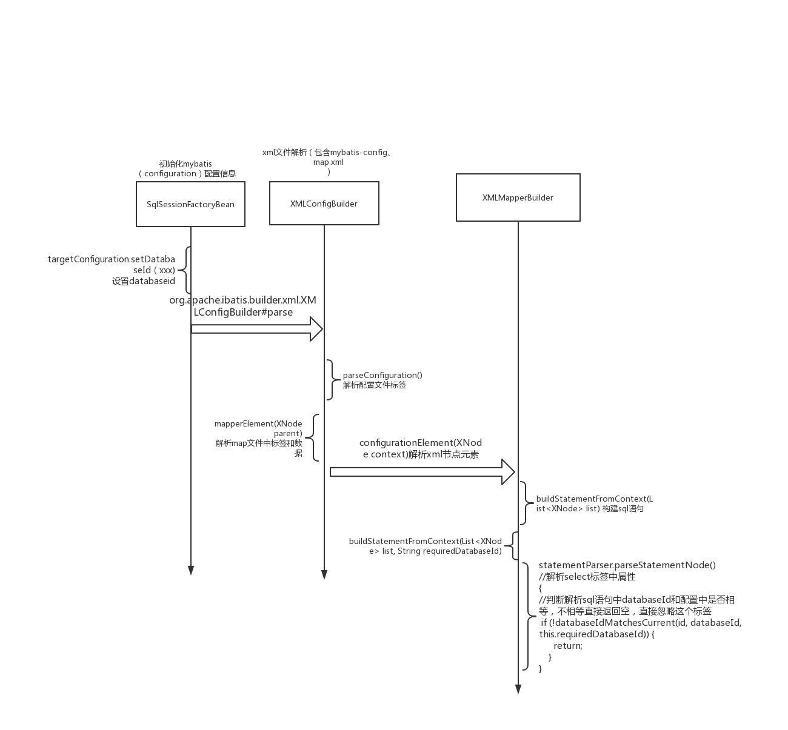

# mybatis databaseIdProvider详解

## 1.环境

- jdk8
- mybatis3.5.2
- Spring 5.1.9.RELEASE
- spring-jdbc 5.1.9.RELEASE


## 2.官方解释

myBatis可以执行不同语句根据配置数据库，多个数据提供商依靠语句中`databasId`属性，mybatis加载sql语句在没有`databaseId`或者`databaseId`匹配当前一个，在相同sql语句没有`databaseId`被匹配会丢弃。

## 3.执行流程




Step1:初始化`SqlSessionFactoryBean` 

```java

  <bean id="sqlSessionFactory" class="org.mybatis.spring.SqlSessionFactoryBean">
        <property name="dataSource" ref="dataSource" />
        <!-- 自动扫描路径下xml文件-->
<!--     <property name="mapperLocations" value="classpath*:mapper/*.xml" />-->

        <!-- 自动扫描路径下配置文件-->
        <property name="configLocation" value="classpath:mybatis-config.xml"/>
        <property name="databaseIdProvider" ref="databaseIdProvider"/>
    </bean>
    


```


step2：设置databaseId

```java
  
……………………
if (this.databaseIdProvider != null) {// fix #64 set databaseId before parse mapper xmls
      try {
        targetConfiguration.setDatabaseId(this.databaseIdProvider.getDatabaseId(this.dataSource));
      } catch (SQLException e) {
        throw new NestedIOException("Failed getting a databaseId", e);
      }
    }
    ………………
```

Step3：解析config标签配置文件

```java
 xmlConfigBuilder.parse()-> parseConfiguration(parser.evalNode("/configuration"))
   -> mapperElement(root.evalNode("mappers"))->  mapperParser.parse()
   	  -> configurationElement(parser.evalNode("/mapper"))
       ->buildStatementFromContext(context.evalNodes("select|insert|update|delete"))
        ->buildStatementFromContext(list, configuration.getDatabaseId())
   			 -> statementParser.parseStatementNode()
```

Step4:分析parseStatementNode方法

```java
 
……………………
String id = context.getStringAttribute("id");
    String databaseId = context.getStringAttribute("databaseId");

		//关键点 如果map.xml中配置 databaseId="mysql"，判断和上述文件中dataSoure metaData.getDatabaseProductName()是否相等，不相等直接忽略 不会保存org.apache.ibatis.session.Configuration#mappedStatements
    if (!databaseIdMatchesCurrent(id, databaseId, this.requiredDatabaseId)) {
      return;
    }
………………
```

